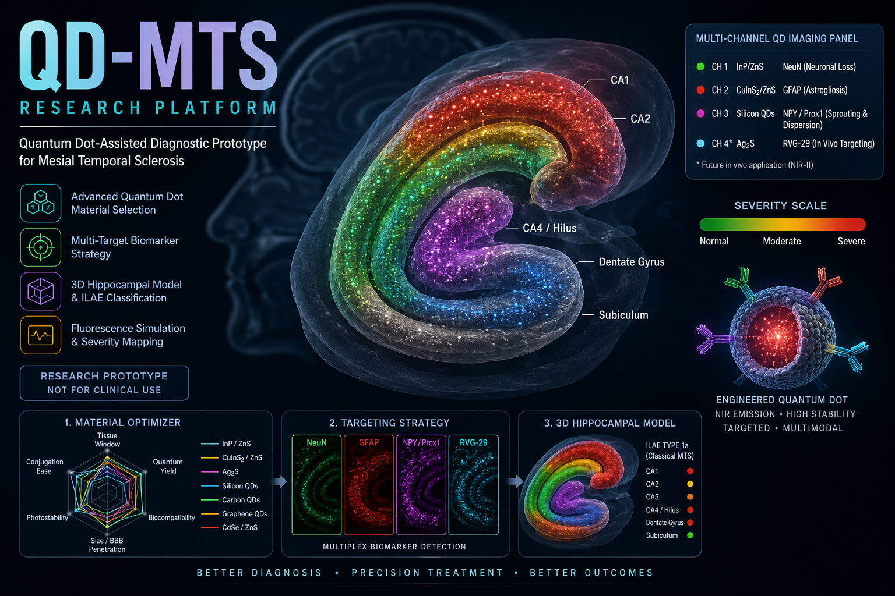
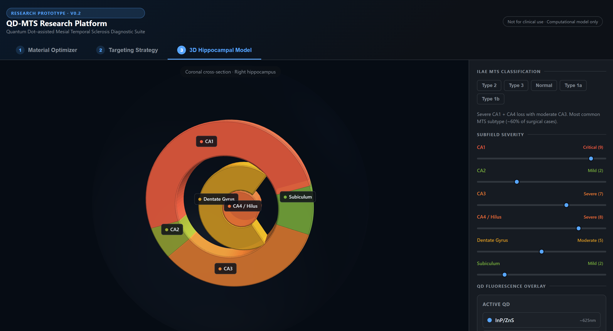
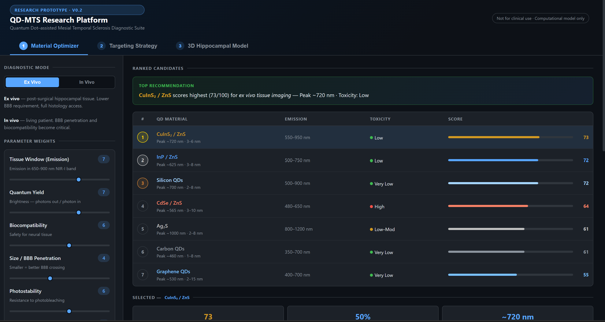
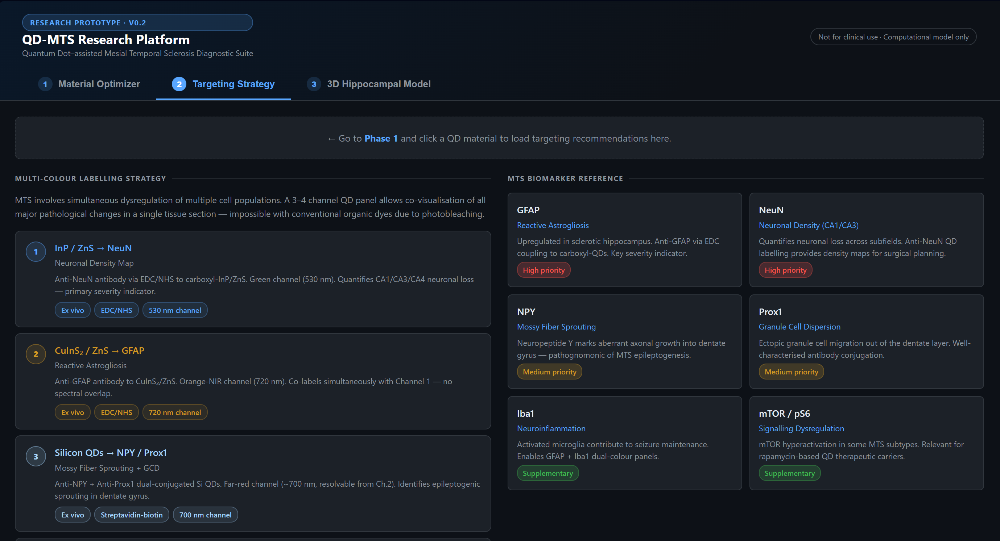

# QD-MTS Research Platform

**Quantum Dot–Assisted Diagnostic Prototype for Mesial Temporal Sclerosis**

An interactive computational research platform exploring engineered quantum dot nanoparticles to enhance the accuracy of MTS diagnosis, hippocampal subfield mapping, and fluorescence-guided surgical planning in drug-resistant temporal lobe epilepsy.

## 🎯 Overview

Mesial Temporal Sclerosis (MTS) is the most common structural cause of drug-resistant focal epilepsy. Current imaging (MRI) often misses subtle or early-stage changes, leading to incomplete resections and persistent seizures post-surgery (30–40% recurrence rate).

This prototype demonstrates how **quantum dots (QDs)** — with their tunable NIR emission, high photostability, and targeted conjugation — could enable multi-channel molecular imaging of key MTS biomarkers (neuronal loss, gliosis, mossy fiber sprouting, etc.) at unprecedented resolution.

## ✨ Key Features

- **Phase 1: Material Optimizer**  
  Real-time ranking of 7 QD candidates (InP/ZnS, CuInS₂/ZnS, Ag₂S, Silicon QDs, etc.) with weighted parameters: Tissue Window, Quantum Yield, Biocompatibility, BBB Penetration, Photostability, and Conjugation Ease. Ex Vivo vs In Vivo modes.

- **Phase 2: Targeting Strategy**  
  Multi-channel labelling panel linking QDs to MTS biomarkers (NeuN, GFAP, NPY/Prox1, RVG-29). Detailed conjugation protocols (EDC/NHS, streptavidin-biotin, thiol-maleimide).

- **Phase 3: 3D Hippocampal Model**  
  Interactive coronal 3D visualization of the right hippocampus built with Three.js. ILAE subtype presets (Type 1a, 1b, 2, 3), manual severity sliders, and dynamic QD fluorescence particle overlays that scale with pathology severity.

- **Additional Highlights**  
  - Responsive dark UI with smooth animations  
  - Emission spectrum comparison chart  
  - Real-time diagnostic readout  
  - Educational tool with scientific grounding

## 📚 Research Documentation

For a comprehensive scientific background, methodology, biomarker details, and clinical translation roadmap, see:

**[RESEARCH.md](Research/RESEARCH.md)** — Detailed project documentation and scientific rationale.

## 🛠️ Tech Stack

- **Core**: HTML5, CSS3 (Custom Properties, Grid/Flexbox), Vanilla JavaScript
- **Visualization**: Three.js (3D rendering & particle systems), Chart.js (radar, bar, line charts)
- **Architecture**: Self-contained single-file web application (no build step required)

## 🚀 Quick Start

1. Clone or download the repository
2. Open `MTS_QD_Research_Platform.html` in any modern browser (Chrome/Edge/Firefox recommended)
3. No installation or server required

**Live Demo**: [Open the Simulator](https://dhrithialex.github.io/qd-mts-research-platform/MTS_QD_Research_Platform.html)

## 📚 Scientific Background

See `QD_MTS_Platform_Documentation.pdf` for:
- MTS pathology and ILAE classification
- Quantum dot optical & biological properties
- Biomarker targeting rationale
- Proposed clinical translation roadmap

**Disclaimer**: Research prototype only — **Not for clinical diagnostic use**.

## 🎨 Gallery

### Project Screenshots

  
    
  
    
  

## 🔮 Future Directions

- Integration with real MRI/histology data
- Expanded QD library and AI-assisted scoring
- VR/AR mode for surgical planning
- Exportable reports and simulation parameters

## 📄 License

MIT License — Feel free to fork, extend, or use as inspiration for related neurotech/quantum projects.

## 🙋‍♂️ About

Built as a conceptual bridge between quantum nanotechnology and clinical epilepsy research. Demonstrates interdisciplinary skills in materials science, neuroscience, and interactive visualization.

---

**Star this repo if you find it useful!** Contributions, feedback, and collaborations welcome.

*Version 0.2 — 2026*
